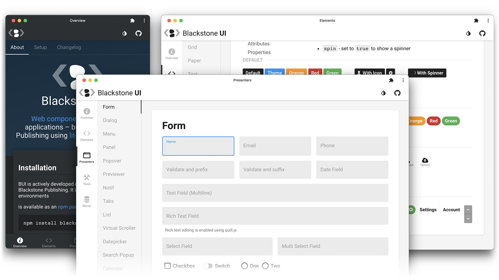

<p align="center">
  <a href="https://github.com/kjantzer/bui" rel="noopener" target="_blank">
    
  </a>
</p>

<h1 align="center">Blackstone UI (BUI)</h1>

Web components for creating interfaces - built with [Lit](https://lit.dev/) by [Blackstone Publishing](https://blackstonepublishing.com)

<div align="center">

[](https://bui.js.org)

</div>

[](https://bui.js.org)

## 🎉 Features
- 📱 Progressive scaling from desktop to mobile devices
- 🌗 Dark/Light Mode
- 🎨 Color Themes
- 🧑‍💻 Modern async/await style structure
- 🛠 Customizable with css vars and "parts"
- 🔗 Extensible and interoperable with other frameworks
- ⚓️ URL route management

## ℹ️ Overview

The stable release of v1 [web components](https://developer.mozilla.org/en-US/docs/Web/Web_Components) with the addition of [lit](https://lit.dev) make for an incredible framework for writing user interface components.

Shadow DOM, CSS [custom properties](https://developer.mozilla.org/en-US/docs/Web/CSS/Using_CSS_custom_properties), and css ["parts"](https://developer.mozilla.org/en-US/docs/Web/CSS/::part) makes encapsulation easy yet still customizable.

**BUI is a library** of low level custom elements, full featured "presenters", useful utility functions, application router, code extension "helpers", node.js server classes (for creating RESTful APIs), and more. 

**Import and use a select few components or use most of it to create a full featured application.**

⭐️ The [demo/documention](http://bui.js.org/) is an example of what can be built with BUI and a good resource for reading more about what the library offers.

## ⬇️ Installation
BUI is actively developed on a daily basis by [Blackstone Publishing](https://www.blackstonepublishing.com). It is used in multiple internal application production environments. New features, changes, and bug fixes occur weekly - however, it may be slower to reach this public repo.

Although BUI is available as an [npm package](https://www.npmjs.com/package/blackstone-ui), the library is updated too frequently to publish consistent versions. 

**Installing the latest is recommended:**

```
npm install https://github.com/kjantzer/bui.git --save
```

We will attempt to document *major breaking* changes in the changelog. If you find any bugs/issues, please report or submit a PR.

## 🚀 Getting Started

Cloning and runing the demo/docs locally on your computer would be a good place to start. From there you can see how the various components work together to create an application.

Install parcel globally if you don't already have it installed
```bash
$ npm install -g parcel-bundler
```

Install the dependencies, then start the demo app
```bash
$ git clone https://github.com/kjantzer/bui.git
$ cd bui
$ npm install
$ npm start
```

You should then be able to view the demo at:  
http://localhost:1234

## 🚨 Notice

Since BUI is actively developed nearly every day and done so by a small team, the documentation likely won't be 100% up to date. You may need to reference the physical code to discover some options/settings.

No software is bug free, but the latest commit of BUI should be fairly stable as it is used in a production environment at Blackstone.
