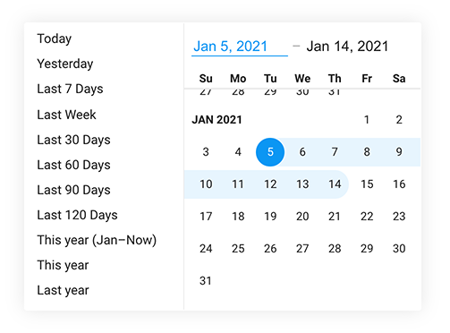

Date Picker
===============

A date picker inspired by the new Google Analytics date picker.



```js
import Datepicker from 'bui/presenters/datepicker'
import Popover from 'bui/presenters/popover'

let datepicker = new Datepicker({
    value: new Date(), // defaults to today
    // value: [startDate, endDate], // range of dates
    // value: '2021-01-01,2021-01-15' // range of date strings
    range: true, // select range of dates or single date
    min: '1975-01-01', // default
    max: '2099-12-31', // default
    presets: [], // empty array means use all default presets
})

// present the datepicker in a popover
new Popover(target, datepicker, {
    onClose(){
        console.log(datepicker.value)
    }
})
```

## Properties
- `.value` - returns `date` or `{start, end}` (depending on range setting)

## Presets

#### Default
All default presets are used unless `presets` option is overriden. (Presets are also hidden if `range:false`)

- `today`
- `yesterday`
- `7 days`
- `last week`
- `30 days`
- `60 days`
- `90 days`
- `120 days`
- `this year`
- `year`
- `last year`

#### Custom

A custom preset defaults "today". Presets must have a `label` and either a `value` (sets both end and start), or `start` and/or `end`.

- `value(today)` - can also be key of default preset
- `start(today)`
- `end(today, start)`

```js
let presets = [
    // use a few default presets
    'today',
    'yesterday',

    // custom presets
    {
        label: '3 days ago',
        value:d=>d.add(-3, 'days')
    },{
        label: 'Last 14 days',
        description: 'Including today'
        start:d=>d.add(-14, 'day')
    },{
        label: 'Two weeks ago',
        start:d=>d.startOf('week').add(-14, 'day'),
        end: (d, start)=>start.add(7, 'day')
    },{
        label: 'Next 7 days',
        end:d=>d.add(7, 'day')
    }
]
```

## Parts
- `header`
- `input`
- `months-header`
- `months`
- `presets

## Styles
- `--pad` - padding around each secion (header, months)
- `--gap` - gap between days
- `--size` - size of each day
- `--font-size` - for months

## Events
- `apply` - e.detail returns value
- `cancel` 
- `done` e.detail returns {action, value} (action is 'apply' or 'cancel')

## Dependencies
- [dayjs](https://www.npmjs.com/package/dayjs)
- [lit-virtualizer](https://www.npmjs.com/package/lit-virtualizer)